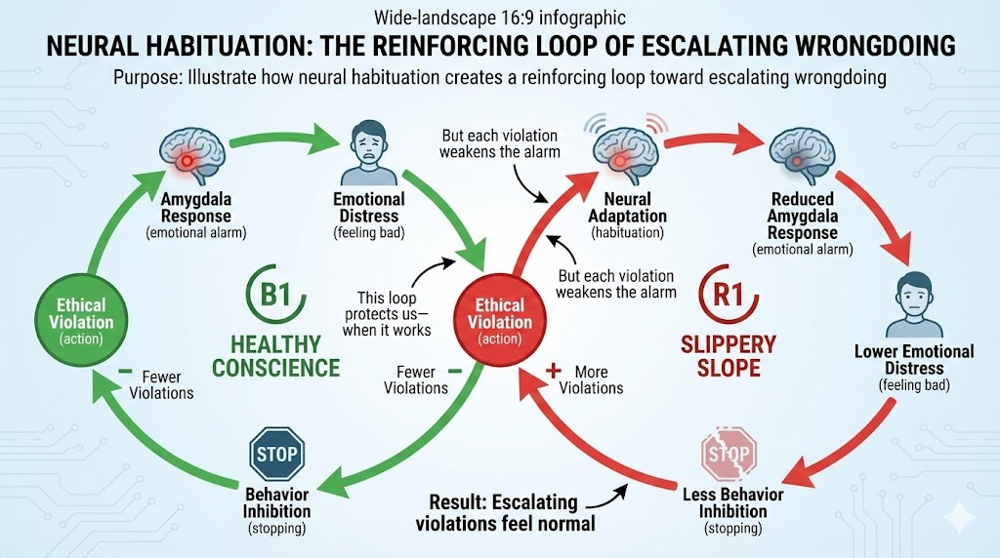

# Intervention Design and Leverage Points

*Here's the uncomfortable truth about human beings: we're not the perfectly rational decision-makers we like to think we are. We routinely make choices that harm ourselves, our families, and our communities—often while believing we're doing the right thing. Understanding why this happens isn't just fascinating neuroscience; it's essential knowledge for anyone who wants to create positive change.*

*This chapter takes you inside the brain to see how moral decisions actually get made—and how that process can go spectacularly wrong or spectacularly right. We'll explore how ordinary people slide down ethical slippery slopes, and how ordinary people also climb upward spirals of courage. Then we'll use these insights to design interventions that actually work: behavioral nudges, policy tools, organizing strategies, and movement-building approaches that account for how humans really behave, not how we wish they would.*

*The goal isn't to manipulate people—it's to understand human nature well enough to help people live according to their own values. That's not manipulation; that's liberation.*

## The Neurobiology of Moral Decision-Making

Before we can design effective interventions, we need to understand what's happening in the brain when people make ethical choices. Recent neuroscience research reveals something remarkable: morality isn't just philosophy—it's biology.

### Your Brain on Ethics

When you encounter an ethical violation, your brain reacts with *physical* disgust, similar to how it would respond to a foul smell or rotting food. This isn't a metaphor—fMRI studies show the same brain regions activating for both moral and sensory disgust.

**Key Brain Regions in Moral Processing:**

| Brain Region | Function | Role in Ethics |
|--------------|----------|----------------|
| Anterior insula | Processes physical disgust | Creates visceral "gut reactions" to wrongdoing |
| Amygdala | Detects threats, generates fear | Triggers emotional alarm at ethical violations |
| Prefrontal cortex | Logical reasoning, planning | Provides context, weighs consequences |
| Anterior cingulate cortex | Evaluates rewards and penalties | Assesses costs and benefits of choices |
| Nucleus accumbens | Reward processing | Determines if action feels "worth it" |
| Medial orbitofrontal cortex | Values processing | Interestingly, processes both moral virtue AND aesthetic beauty |

!!! tip "The Beauty-Virtue Connection"
    Your brain processes moral goodness and aesthetic beauty in the same region. This may explain why we describe good people as "beautiful souls" and why experiencing beauty can make us feel more ethical. Art matters for ethics!

### The Habituation Effect: How Good People Go Bad

Here's where it gets troubling. The same neural mechanism that helps us adapt to unpleasant situations—habituation—can also help us adapt to our own wrongdoing.

**The Moral Deterioration Process:**

1. **Initial Violation:** Strong disgust and fear responses activate. You feel terrible.
2. **Repetition:** Reduced amygdala activation with each transgression. You feel less terrible.
3. **Normalization:** Wrongdoing becomes routine. You barely notice.
4. **Escalation:** Progressively larger violations feel acceptable. What once horrified you now seems fine.

**The Research Evidence:**

fMRI studies of people lying in laboratory settings show a clear pattern:

- First lie: Strong amygdala activation, significant emotional distress
- Fifth lie: Reduced amygdala response
- Tenth lie: Minimal emotional response
- Result: Each lie tends to be larger than the last

The emotional alarm system that should stop us from escalating... gets quieter with each transgression.

#### Diagram: Neural Habituation to Wrongdoing

    
Habituation Feedback Loop Diagram

    Type: diagram

    Purpose: Illustrate how neural habituation creates a reinforcing loop toward escalating wrongdoing

    Bloom Level: Understand (L2) - Students grasp the neurobiological mechanism

    Learning Objective: Students will understand why ethical violations tend to escalate without intervention

    Components:
    - Ethical Violation (action)
    - Amygdala Response (emotional alarm)
    - Emotional Distress (feeling bad)
    - Behavior Inhibition (stopping)
    - Neural Adaptation (habituation)

    Loops:
    1. Balancing Loop B1 (labeled "Healthy Conscience" - when working):
       - Ethical Violation → Strong Amygdala Response → High Emotional Distress → Behavior Inhibition → Fewer Violations

    2. Reinforcing Loop R1 (labeled "Slippery Slope" - when habituation kicks in):
       - Ethical Violation → Neural Adaptation → Reduced Amygdala Response → Lower Emotional Distress → Less Behavior Inhibition → More Violations → More Neural Adaptation

    Key annotations:
    - "This loop protects us—when it works" near B1
    - "But each violation weakens the alarm" pointing to habituation pathway
    - "Result: Escalating violations feel normal" at bottom

    Visual style: CLD with clear R/B notation
    Color scheme: Green for healthy conscience loop, red for slippery slope loop

    Implementation: Static CLD with annotations

### Case Study: The Downward Spiral of Chris Bentley

Chris Bentley was a successful businessman—until he wasn't. His story illustrates how neural habituation can turn a small mistake into catastrophic fraud.

**The Progression:**

1. **Initial trigger:** Bentley made an innocent administrative error in business letters
2. **First choice point:** Rather than admit the mistake (embarrassing but fixable), he decided to cover it up
3. **Escalation begins:** Cover-up required risky deals to compensate for growing losses
4. **Full descent:** Eventually operating a $40 million fraud scheme
5. **Personal collapse:** Self-medication, suicidal ideation, complete unraveling

**What Made It Worse:**

- **Risk tolerance from military service:** Bentley was used to high-stakes situations
- **"Zero-mistake" culture:** Admitting errors felt unacceptable
- **Rationalization:** Framed fraud as "the lesser of two evils"
- **Gradual normalization:** Each bogus transaction felt less wrong than the last

**The Intervention Insight:** The critical moment was the *first* choice to cover up rather than admit error. By the time Bentley was deep in fraud, his amygdala had habituated—the alarm bells weren't ringing anymore.

### The Courage Habituation Pathway: How Ordinary People Become Heroes

But here's the hopeful part: the same neural mechanism works in reverse. Just as wrongdoing gets easier with practice, *so does courage*.

**Building Moral Strength:**

1. **Initial courage:** Overcoming fear through prefrontal regulation (the thinking brain calms the alarm brain)
2. **Success experience:** Acting on values creates positive reinforcement
3. **Neural strengthening:** Courage pathways become more robust
4. **Escalating bravery:** Each courageous act makes the next one easier

**The Snake Study:**

Researchers had participants who were afraid of snakes choose whether to bring a snake closer to them. When participants chose courage over fear:

- Increased activity in the subgenual anterior cingulate cortex (emotion regulation)
- Decreased amygdala activation (reduced fear)
- Progressive habituation to discomfort
- Growing willingness to face the fear again

The same process that can habituate you to wrongdoing can habituate you to *doing the right thing despite fear*.

### Case Study: The Upward Spiral of Aquilino Gonell

Capitol Police Officer Aquilino Gonell's story shows the courage pathway in action.

**The Progression:**

1. **Foundation:** Childhood values from grandfather ("Never tell lies")
2. **Courage practice:** Military service developed physical courage
3. **Critical moment:** Defended the Capitol on January 6
4. **Fear-facing:** Gave first media interview despite fear of retaliation
5. **Continued growth:** Congressional testimony and ongoing advocacy

**What Made It Work:**

- **Strong foundational values:** Clear personal rules established early
- **Progressive courage building:** Each brave act strengthened the next
- **Internal rewards:** Living by values felt better than avoiding fear
- **Social meaning:** Actions connected to larger purpose

!!! example "The 'Small Snakes' Principle"
    You don't build courage by suddenly facing your biggest fear. You build it by bringing progressively larger "snakes" closer—small acts of integrity that strengthen the neural pathways for bigger ones.

#### MicroSim: Moral Trajectory Simulator

    
Interactive Moral Trajectory Visualization

    Type: microsim

    Learning Objective: Students will explore how small initial choices compound into dramatically different moral trajectories (Bloom Level: Analyze - L4)

    Canvas layout:
    - Left panel (250x600): Character profile and choice history
    - Center area (400x600): Animated trajectory visualization
    - Right panel (250x600): Neural state indicators and outcome metrics

    Simulation concept:
    Model a character facing a series of ethical choice points over time

    Character setup:
    - Name and role (student, employee, executive, etc.)
    - Initial "moral courage" level (1-10)
    - Initial "habituation to wrongdoing" level (1-10)
    - Risk tolerance (low/medium/high)
    - Support system strength (weak/moderate/strong)

    Choice scenarios (10 sequential):
    1. Small administrative error: Admit or cover up?
    2. Colleague asks for small favor that bends rules: Help or decline?
    3. Observe supervisor doing something questionable: Report or ignore?
    4. Opportunity to take credit for someone else's work: Take or give credit?
    5. Pressure to meet targets through ethically gray methods: Comply or push back?
    (etc., with escalating stakes)

    Neural state tracking:
    - Amygdala sensitivity meter (decreases with each violation, increases with each courageous act)
    - Courage pathway strength (grows with each brave choice)
    - Rationalization capacity (grows with each justified violation)

    Visualization:
    - Central graph showing trajectory over time
    - Y-axis: Ethical standing (corruption to integrity)
    - X-axis: Time/choices
    - Animated character icon moves along trajectory
    - Fork points show alternative paths not taken
    - Color gradient: Red (descending) to Green (ascending)

    Outcome metrics:
    - Final ethical standing
    - Personal wellbeing score
    - Relationship quality score
    - Career sustainability score
    - Community impact score

    Interactive controls:
    - Make choices for character at each fork
    - "Reset" to try different path
    - "Compare Paths" to see alternative outcomes
    - Speed slider for animation
    - "Random Character" generator

    Implementation: p5.js with branching narrative and state tracking

### Factors That Determine Moral Direction

Understanding what tips people toward courage or collapse helps us design better interventions.

**Accelerators of Moral Collapse:**

| Individual Factors | Environmental Factors |
|-------------------|----------------------|
| High risk tolerance | Peer pressure and conformity |
| Pressure and time constraints | Corrupt organizational culture |
| Cognitive shutdown under stress | Lack of accountability |
| Self-justification and rationalization | Gradual escalation opportunities |
| Weak personal identity/values | "Zero-mistake" expectations |

**Builders of Moral Courage:**

| Individual Practices | Organizational Supports |
|---------------------|------------------------|
| Mindfulness and self-reflection | Ethical leadership modeling |
| Clear personal values ("flat-ass rules") | Mistake admission culture |
| "Heroic imagination" preparation | Swift transgression addressing |
| Perspective-taking abilities | Zero-tolerance for retaliation |
| Progressive courage practice | Celebration of moral courage |

!!! tip "Heroic Imagination"
    Psychologist Philip Zimbardo (of Stanford Prison Experiment fame) developed "Heroic Imagination Project" training that helps people prepare mentally for ethical challenges *before* they face them. When you've imagined standing up for what's right, you're more likely to actually do it.

## Understanding Change Dynamics

Now that we understand how individuals change, let's zoom out to understand how change spreads through populations and organizations.

### The Diffusion of Innovation Model

Not everyone adopts new ideas—including new ethical practices—at the same time. Everett Rogers identified five categories of adopters:

| Category | % of Population | Characteristics | Change Strategy |
|----------|----------------|-----------------|-----------------|
| Innovators | 2.5% | Risk-takers, cosmopolitan connections | Enable and showcase |
| Early Adopters | 13.5% | Opinion leaders, respected | Target for influence |
| Early Majority | 34% | Deliberate, follow leaders | Provide social proof |
| Late Majority | 34% | Skeptical, wait for proof | Show widespread adoption |
| Laggards | 16% | Traditional, resistant | May never adopt |

**The Tipping Point:**

When adoption reaches approximately 16% (Innovators + Early Adopters), you hit a "tipping point" where the Early Majority begins to follow. This is why change often feels painfully slow... until suddenly it feels unstoppable.

#### Diagram: Innovation Adoption Curve

    
Interactive Adoption Curve Visualization

    Type: chart

    Purpose: Illustrate how innovations spread through populations and where tipping points occur

    Bloom Level: Apply (L3) - Students use this model to plan change strategies

    Learning Objective: Students will identify the current adoption stage for an ethical change and design appropriate strategies

    Chart type: Combined bell curve (adopter distribution) and S-curve (cumulative adoption)

    X-axis: Time or stage of adoption
    Y-axis (left): Number of adopters (bell curve)
    Y-axis (right): Cumulative adoption percentage (S-curve)

    Data visualization:
    - Bell curve showing five adopter categories as colored sections
    - Innovators (2.5%): Purple
    - Early Adopters (13.5%): Blue
    - Early Majority (34%): Green
    - Late Majority (34%): Yellow
    - Laggards (16%): Gray

    - Overlaid S-curve showing cumulative adoption
    - Vertical line at 16% mark labeled "Tipping Point"
    - Annotation: "Before this: change feels impossible. After: change feels inevitable"

    Interactive elements:
    - Dropdown to select real-world example (renewable energy adoption, anti-smoking norms, marriage equality, etc.)
    - Show historical data overlaid on theoretical curve
    - Slider to explore "what if we targeted different groups"

    Title: "How Ethical Change Spreads: The Adoption Curve"

    Implementation: Chart.js with interactive overlays

**Implications for Ethical Change:**

- **Don't try to convince everyone:** Focus on Early Adopters first
- **Create visible proof:** Let Innovators demonstrate success
- **Different messages for different groups:** Innovators want novelty; Late Majority wants safety
- **Patience before the tipping point, momentum after:** The hardest work happens before 16%

### Behavioral Economics: How Humans Actually Decide

Traditional economics assumes people are rational utility maximizers. Behavioral economics studies how people actually behave—which is often *not* rationally.

**Key Cognitive Biases Affecting Ethical Decisions:**

#### Status Quo Bias

**What it is:** People prefer things to stay the same, even when change would benefit them.

**Why it matters for ethics:** Harmful practices persist partly because they're familiar.

**Intervention strategy:** Make ethical options the *default* choice.

- **Example:** Opt-out (rather than opt-in) for sustainable energy. People who would benefit from switching often don't—unless switching is automatic.

#### Loss Aversion

**What it is:** People feel losses about twice as strongly as equivalent gains.

**Why it matters for ethics:** "What you might gain" is less motivating than "what you'll lose."

**Intervention strategy:** Frame ethical choices in terms of avoiding loss.

- **Weak framing:** "Join us to build a better future!"
- **Strong framing:** "Don't let your children lose the chance for a healthy planet."

#### Social Proof

**What it is:** People look to others to determine correct behavior, especially under uncertainty.

**Why it matters for ethics:** If unethical behavior seems normal, it spreads. If ethical behavior seems normal, it spreads too.

**Intervention strategy:** Highlight when ethical behavior is becoming common.

- **Example:** "Join the millions of families already choosing clean energy" works better than "Be a pioneer!"

#### Present Bias (Temporal Discounting)

**What it is:** People value immediate rewards more than future benefits, even when future benefits are larger.

**Why it matters for ethics:** Many ethical choices involve short-term costs for long-term benefits.

**Intervention strategy:** Create immediate rewards for ethical choices.

- **Example:** Instant rebates for energy-efficient appliances make the future savings feel real now.

#### Anchoring

**What it is:** People's judgments are influenced by initial reference points, even arbitrary ones.

**Why it matters for ethics:** The first number people hear shapes their sense of what's reasonable.

**Intervention strategy:** Set ambitious anchors.

- **Example:** Starting negotiations with bold climate targets makes moderate targets seem reasonable rather than extreme.

#### MicroSim: Bias Detection Game

    
Identify the Cognitive Bias Game

    Type: microsim

    Learning Objective: Students will recognize cognitive biases in real-world ethical decision scenarios (Bloom Level: Apply - L3)

    Canvas layout:
    - Top area (600x200): Scenario description
    - Middle area (600x250): Bias selection buttons and explanation
    - Bottom area (600x150): Score, streak, and learning summary

    Game mechanics:
    - Present 15 scenarios involving ethical decisions
    - Player identifies which cognitive bias is at play
    - Immediate feedback with explanation
    - Points for correct identification
    - Bonus points for identifying intervention strategy

    Bias options:
    - Status Quo Bias
    - Loss Aversion
    - Social Proof
    - Present Bias
    - Anchoring
    - Availability Heuristic
    - Confirmation Bias
    - Optimism Bias

    Example scenarios:
    1. "A company continues using a harmful chemical in production because 'that's how we've always done it' even though safer alternatives exist." → Status Quo Bias

    2. "Consumers are more motivated by 'Don't lose 30% of your retirement savings to climate costs' than 'Gain a healthier planet for your grandchildren.'" → Loss Aversion

    3. "An employee hesitates to report safety violations because 'no one else seems concerned about it.'" → Social Proof

    4. "A shopper chooses the cheaper unethical product saying 'I'll buy sustainable next time when I have more money.'" → Present Bias

    5. "After hearing that a company's CEO earns $50 million, workers view $500,000 executive salaries as 'reasonable.'" → Anchoring

    Scoring:
    - Correct bias identification: 10 points
    - Correct intervention strategy: 5 bonus points
    - Streak bonus: +2 points per consecutive correct answer

    Feedback system:
    - Correct: Green highlight, reinforcing explanation
    - Incorrect: Show correct answer with detailed explanation of why

    End-game summary:
    - Total score
    - Biases most/least recognized
    - Personalized study recommendations

    Implementation: p5.js with scenario database and scoring logic

## The Limits of Quantification: A Critical Reflection on Scientism

Before we proceed to design interventions based on data and behavioral science, we must pause for a critical reflection. This course has emphasized measurement, metrics, and evidence-based approaches. But what might we be missing?

### What is Scientism?

**Scientism** is the belief that the scientific method—particularly computational, formal, and mathematical-logical reasoning—is the only valid way of understanding the world. It goes beyond appreciating science's power to claiming science as the *exclusive* path to truth.

This is distinct from science itself. Science is a method of inquiry that has proven extraordinarily powerful for understanding the natural world. Scientism is an *ideology* that elevates that method to the status of religion—complete with its own blind spots and dogmas.

!!! warning "This Course's Potential Blind Spot"
    A course built on "data-driven ethics" and "measuring harm" inherently privileges what can be counted. We've spent chapters discussing DALYs, economic costs, and quantifiable metrics. But what about harms that resist quantification?

### What Gets Missed When We Only Count

**Harms to meaning and dignity:** How do you quantify the harm of a job that pays well but strips workers of autonomy and purpose? The DALY framework can measure physical and mental health impacts, but the erosion of human dignity often precedes measurable symptoms.

**Harms to relationships and community:** Social isolation, the weakening of civic bonds, the replacement of human connection with algorithmic interaction—these harms are real but difficult to reduce to numbers.

**Harms to ways of knowing:** Indigenous knowledge systems, contemplative traditions, artistic and narrative ways of understanding—when we privilege only what can be measured, we may inadvertently devalue other forms of wisdom.

**Long-term and diffuse harms:** Some of the most serious harms unfold over generations or affect systems so complex that causal attribution becomes impossible. Climate change is partially measurable; the loss of cultural diversity or the erosion of democratic norms is harder to quantify.

### The Machine Intelligence Parallel

The rise of artificial intelligence makes this reflection urgent. AI systems excel at pattern recognition, optimization, and processing vast datasets. If we conflate intelligence with these capabilities, we risk:

- **Devaluing human judgment:** Treating human wisdom as inferior to algorithmic processing
- **Automating the wrong things:** Optimizing for measurable proxies while ignoring unmeasurable essentials
- **Creating false equivalences:** Assuming that because AI can process language, it understands meaning

This doesn't mean AI is harmful or that data-driven approaches are wrong. It means we must be humble about their limits.

### Integrating Multiple Ways of Knowing

Effective advocacy for change requires more than data. It requires:

**Narrative and story:** Humans understand the world through stories, not spreadsheets. The most powerful social movements have always combined evidence with compelling narratives that speak to values, identity, and meaning.

**Ethical intuition:** Sometimes our moral intuitions detect wrongs before we can articulate or measure them. The visceral sense that "something is wrong here" often precedes—and motivates—the research that eventually produces data.

**Relational knowledge:** Understanding power, culture, and community often requires presence, relationship, and long engagement—not just data collection.

**Wisdom traditions:** Religious, philosophical, and indigenous traditions have spent millennia grappling with questions of how to live well. Their insights don't fit neatly into regression models, but they contain hard-won wisdom.

### Practical Implications

This critique doesn't mean abandoning data-driven approaches. It means:

1. **Use data as a tool, not a master:** Data can inform decisions but shouldn't make them. Human judgment, informed by multiple sources of wisdom, remains essential.

2. **Be humble about what you can't measure:** When designing interventions, explicitly consider unmeasurable harms and benefits. Ask: "What might we be missing because we can't count it?"

3. **Combine evidence with narrative:** Effective advocacy uses data to support stories that speak to human values. Neither data alone nor stories alone are sufficient.

4. **Listen to those who know differently:** Communities affected by harm often understand it in ways that don't show up in surveys or statistics. Participatory approaches that center affected voices may reveal what metrics miss.

5. **Recognize the limits of optimization:** Not every problem is an optimization problem. Some situations require wisdom, discernment, and acceptance of irreducible uncertainty.

??? question "Reflection: What has this course missed?"
    Think about an ethical issue you care about. What aspects of that issue resist quantification? What sources of wisdom—personal, traditional, relational—inform your understanding beyond what data could tell you?

!!! tip "The Complementary Approach"
    The goal is not to replace quantitative analysis with intuition, but to recognize that both have essential roles. Data without wisdom is dangerous. Wisdom without data is often ineffective. The skilled advocate for change learns to work with both.

## Nudge Theory and Choice Architecture

Now we get practical. How do we use these behavioral insights to design interventions that help people act on their values?

### Choice Architecture: Designing Contexts for Better Decisions

**Choice architecture** is the deliberate design of the environment in which people make decisions. Small changes to how choices are presented can dramatically affect what people choose—without restricting their freedom.

**Core Nudge Techniques:**

#### Default Options

The most powerful nudge: make the ethical option what happens automatically.

| Traditional Default | Ethical Default | Impact |
|--------------------|-----------------|--------|
| Opt-in for organ donation | Opt-out organ donation | Donation rates: 15% → 85% |
| Standard energy plan | Renewable energy plan | Green energy adoption: 3% → 90% |
| Paper receipts | Email receipts | Paper waste reduction: 70% |
| Conventional investments | ESG-screened investments | Sustainable investment: 12% → 65% |

#### Simplification

Make the ethical choice the *easy* choice.

- **Complex:** "Compare 47 energy providers using this spreadsheet of rates, sources, and contract terms"
- **Simple:** "Green option" / "Standard option" / "Cheapest option"

#### Social Information

Show people what others are doing.

- "Most guests reuse their towels" (hotel environmental programs)
- "Your neighbors use 20% less energy than you" (utility comparison programs)
- "8 out of 10 employees have signed the ethics commitment"

#### Timely Prompts

Reach people at the moment of decision.

- Calorie information at point of ordering (not buried in a brochure)
- Carbon footprint shown before clicking "purchase"
- Sustainability reminder when setting up new accounts

#### Diagram: Choice Architecture Toolkit

    
Interactive Choice Architecture Design Tool

    Type: infographic

    Purpose: Provide a visual toolkit for designing ethical choice architectures

    Bloom Level: Create (L6) - Students design choice architectures for real scenarios

    Learning Objective: Students will apply nudge principles to design interventions for specific ethical challenges

    Layout: Interactive toolkit with five technique cards and workspace

    Toolkit cards (left side):
    1. Defaults (icon: toggle switch)
       - Hover: "Make the ethical option automatic"
       - Click: Shows examples and implementation tips

    2. Simplification (icon: streamline arrow)
       - Hover: "Reduce complexity, highlight key info"
       - Click: Shows labeling and presentation examples

    3. Social Information (icon: people network)
       - Hover: "Show what others are doing"
       - Click: Shows peer comparison implementations

    4. Timely Prompts (icon: clock/notification)
       - Hover: "Reach people at decision moments"
       - Click: Shows timing strategy examples

    5. Friction Adjustment (icon: speed bump)
       - Hover: "Make harmful choices harder, ethical choices easier"
       - Click: Shows barrier design examples

    Workspace (right side):
    - Scenario selector dropdown
    - Drag toolkit elements into workspace
    - Annotate with specific implementation ideas
    - Generate "Choice Architecture Plan" summary

    Pre-loaded scenarios:
    - Fast food restaurant redesign
    - Online shopping platform
    - Corporate expense reporting
    - Investment account setup
    - Social media privacy settings

    Implementation: HTML/CSS/JavaScript with drag-and-drop

### When Nudges Work—and When They Don't

Nudges are powerful but not magic. They work best when:

- **People already want to do the right thing** but face friction
- **The choice is relatively simple** with clear better/worse options
- **There's no strong opposing motivation** (financial incentive to choose wrong)
- **The context can actually be redesigned** (you have control over the choice environment)

Nudges work less well when:

- **Strong interests oppose the ethical choice** (you're nudging against powerful incentives)
- **The problem is structural** (individual choices can't solve systemic issues)
- **People actively want the harmful option** (addiction, strong preferences)
- **The nudge is perceived as manipulative** (backlash effect)

!!! warning "The Ethics of Nudging"
    Using behavioral science to influence choices raises ethical questions. The key distinction: are you helping people act on their *own* values, or imposing *your* values on them? Transparent nudges toward widely-shared goals (health, sustainability) are generally acceptable. Hidden manipulation toward contested goals is not.

## Policy Design for Ethical Change

Sometimes nudges aren't enough. When individual choice architecture can't solve systemic problems, we need policy interventions.

### The Policy Toolbox

Policymakers have several types of tools available:

| Tool Type | How It Works | Best For | Example |
|-----------|--------------|----------|---------|
| **Command & Control** | Direct rules and prohibitions | Clear safety standards, preventing worst outcomes | Chemical safety limits, age restrictions |
| **Market-Based** | Change prices and incentives | Encouraging innovation, cost-effective solutions | Carbon taxes, cap-and-trade |
| **Information** | Require disclosure and labeling | Consumer choice, transparency | Nutrition labels, emissions reporting |
| **Voluntary** | Industry self-regulation | Emerging issues, building norms | Sustainability commitments, codes of conduct |

### Regulatory Design Principles

Good regulations share common characteristics:

**Clarity:** Rules must be unambiguous.

- What exactly constitutes a violation?
- What are the specific thresholds?
- What documentation is required?

**Enforceability:** Rules must be practically enforceable.

- Can violations be detected?
- Are penalties meaningful?
- Is the enforcement agency adequately resourced?

**Adaptability:** Rules should evolve with conditions.

- Built-in review mechanisms
- Flexibility for technological change
- Sunset clauses forcing reconsideration

**Proportionality:** Punishment should fit the crime.

- Graduated penalties based on severity
- Consideration of intent
- Restorative options where appropriate

### Connecting Policy to Leverage Points

Different policy tools operate at different leverage points:

| Leverage Level | Policy Tool Type | Example |
|---------------|------------------|---------|
| 12 (Numbers) | Taxes, subsidies, caps | Carbon price of $50/ton |
| 10 (Negative Feedback) | Regulations, standards | Emission limits, safety requirements |
| 9 (Positive Feedback) | Incentives, feed-in tariffs | Renewable energy credits |
| 8 (Information) | Disclosure requirements | Climate risk reporting |
| 7 (Rules) | Legal frameworks | Extended producer responsibility |
| 6 (Power) | Governance structures | Stakeholder representation requirements |
| 5 (Goals) | Mission requirements | B-Corp certification |

!!! tip "Policy Layering"
    The most effective policy approaches work at multiple leverage levels simultaneously. Carbon pricing (Level 12) + emission standards (Level 10) + disclosure requirements (Level 8) + clean energy incentives (Level 9) creates reinforcing pressure from multiple directions.

## Corporate Transformation: From CSR to Stakeholder Capitalism

Corporations are where much harm originates—and where much positive change can happen. Understanding how corporate responsibility has evolved helps identify leverage for further transformation.

### The Evolution of Corporate Responsibility

**CSR 1.0: Philanthropic Approach (1970s-1990s)**

- Corporate charity separate from business operations
- "Give back" after making profits however you want
- Focus on reputation management
- Minimal integration with strategy

**CSR 2.0: Strategic Integration (2000s-2010s)**

- Sustainability as competitive advantage
- Integration with business strategy
- Stakeholder engagement processes
- Measurement and reporting frameworks (GRI, ESG)

**CSR 3.0: Systemic Change (2020s+)**

- Business model transformation
- Stakeholder capitalism frameworks
- Purpose-driven organizations
- Regenerative business practices

### The B-Corporation Movement

B-Corporations represent a structural change in how companies are organized:

**Certification Requirements:**

- Verified social and environmental performance
- Legal accountability (modified corporate charter)
- Transparency (public disclosure of impact assessment)

**Legal Structure Changes:**

- Directors legally required to consider all stakeholders (not just shareholders)
- Protection for leaders making stakeholder-oriented decisions
- Annual benefit report requirements
- Third-party standards for measurement

**Why It Matters:**

Traditional corporate law in most jurisdictions requires directors to maximize shareholder value. This creates structural pressure toward harmful externalities. B-Corp status *changes the rules* (Level 7 intervention) so that considering workers, communities, and environment is legally protected.

| Traditional Corporation | B-Corporation |
|------------------------|---------------|
| Maximize shareholder returns | Balance all stakeholder interests |
| Directors can be sued for prioritizing social goals | Directors protected for stakeholder decisions |
| No standardized impact reporting | Annual benefit report required |
| Purpose is making money | Purpose includes positive impact |

## Citizen Engagement and Movement Building

Ultimately, systemic change requires organized people power. Let's examine how successful movements are built.

### Grassroots Organizing Principles

**Power Analysis:** Before you can change anything, understand who has power.

- **Formal power:** Elected officials, executives, board members
- **Informal power:** Opinion leaders, community elders, influential voices
- **Economic power:** Major employers, investors, customers
- **Moral power:** Religious leaders, ethical authorities, respected figures

**Coalition Building:** Bring together diverse stakeholders.

| Coalition Type | Example | Strength | Challenge |
|---------------|---------|----------|-----------|
| Strange bedfellows | Environmentalists + fiscal conservatives on clean energy | Unexpected credibility | Maintaining alignment |
| Issue-based | Multiple groups focused on one policy | Focused power | May dissolve after win |
| Values-based | Groups sharing worldview | Deep commitment | May be too narrow |
| Temporary | Time-limited partnership | Flexibility | Limited relationship building |

### The Story-Based Strategy

Effective movements tell compelling stories that connect:

**Story of Self:** Why are *you* committed to this cause?

- Your personal connection to the issue
- The values that drive you
- Why this matters to your identity

**Story of Us:** What shared experiences and values unite *us*?

- Common challenges we face
- Shared hopes and fears
- The community we're building

**Story of Now:** Why must *we* act *now*?

- The urgent threat or opportunity
- What's at stake if we don't act
- The specific action being called for

#### MicroSim: Campaign Strategy Builder

    
Interactive Advocacy Campaign Designer

    Type: microsim

    Learning Objective: Students will design comprehensive advocacy campaigns using grassroots organizing principles (Bloom Level: Create - L6)

    Canvas layout:
    - Left panel (200x600): Campaign elements palette
    - Center area (500x600): Campaign canvas/timeline
    - Right panel (200x600): Strategy assessment

    Campaign elements palette:

    1. Research & Analysis
       - Issue research
       - Stakeholder mapping
       - Power analysis
       - Opposition research

    2. Goal Setting
       - Policy change
       - Corporate behavior change
       - Cultural norm shift
       - Awareness building

    3. Target Selection
       - Decision-maker identification
       - Pressure point analysis
       - Ally cultivation

    4. Tactics (draggable cards)
       - Public education
       - Media campaign
       - Direct lobbying
       - Grassroots mobilization
       - Shareholder advocacy
       - Consumer campaign
       - Legal action
       - Cultural intervention

    5. Messaging
       - Story of Self template
       - Story of Us template
       - Story of Now template
       - Frame selection

    Campaign canvas:
    - Timeline grid (1 month, 3 months, 6 months, 1 year, 2 years)
    - Drag tactics onto timeline
    - Connect tactics showing dependencies
    - Mark milestones and decision points

    Strategy assessment panel:
    - Coherence score: Do tactics reinforce each other?
    - Feasibility score: Are resources realistic?
    - Impact potential: How likely to achieve goal?
    - Resistance analysis: How will opposition respond?

    Pre-loaded scenarios:
    - Fast fashion reform campaign
    - Local fossil fuel divestment
    - Ultra-processed food labeling
    - Tech platform accountability
    - Pesticide regulation

    Export feature:
    - Generate campaign summary document
    - Timeline visualization
    - Stakeholder map

    Implementation: p5.js with drag-and-drop and assessment logic

### Digital Organizing in the Modern Era

The tools have changed, but the principles remain:

**Social Media Strategies:**

- **Awareness:** Educational content, infographics, explainers
- **Mobilization:** Petition drives, event promotion, action alerts
- **Narrative change:** Storytelling, testimonials, viral moments
- **Community building:** Creating spaces for supporters to connect

**Online-to-Offline Integration:**

The most powerful campaigns connect digital organizing to real-world action:

- Social media drives attendance at physical events
- Digital tools support in-person organizing
- Virtual events expand geographic reach
- Online fundraising enables offline activities

### Shareholder and Consumer Advocacy

Sometimes the most effective pressure comes through economic channels:

**Shareholder Advocacy:**

- Proxy campaigns using shareholder votes to influence policy
- Board composition changes
- Executive compensation tied to sustainability metrics
- Engagement campaigns with institutional investors

**Divestment Campaigns:**

- Individual divestment (personal investment choices)
- Institutional divestment (universities, pension funds, endowments)
- Municipal divestment (local government investment policies)

**The Engagement vs. Divestment Debate:**

| Engagement Approach | Divestment Approach |
|--------------------|---------------------|
| Maintain seat at the table | Remove financial support |
| Influence from within | Create stigma and signal |
| Gradual change possible | Clear moral statement |
| May provide cover for bad actors | May have limited financial impact |

Most effective campaigns use both: engage where there's potential for change, divest where there isn't.

## Measuring Movement Success

How do you know if your advocacy is working?

### Theory of Change Indicators

**Outputs:** Direct products of activities

- Number of people reached
- Media coverage generated
- Events organized
- Policies proposed

**Outcomes:** Changes in behavior, attitudes, or conditions

- Shifts in public opinion
- Corporate policy changes
- Legislative victories
- Market share shifts

**Impact:** Long-term systemic changes

- Industry transformation
- Cultural norm shifts
- Reduced environmental or social harm
- Improved wellbeing metrics

### Historical Case Studies

**Anti-Smoking Movement Timeline:**

| Decade | Key Developments | Leverage Level |
|--------|-----------------|----------------|
| 1950s-60s | Scientific evidence published | 8 (Information) |
| 1970s | Warning labels, advertising restrictions | 7 (Rules), 8 (Information) |
| 1980s | Smoking bans, social stigmatization | 7 (Rules), 4 (Paradigm) |
| 1990s | Tobacco litigation, settlements | 7 (Rules), 12 (Numbers) |
| 2000s | Global framework convention | 7 (Rules), 6 (Power) |

**Result:** US smoking rates dropped from 42% (1965) to 12.5% (2020).

**Key Success Factors:**

- Strong evidence base (researchers)
- Multiple simultaneous strategies (diverse coalition)
- Long-term persistence (decades of work)
- Economic arguments alongside health arguments (multiple frames)
- Legal accountability (tobacco settlements)

??? question "Reflection: What current movement most resembles the tobacco fight?"
    Consider the parallels between tobacco control and current movements around fossil fuels, ultra-processed foods, or social media. What phase is each movement in? What strategies from tobacco control might transfer?

## Bringing It Together: The Intervention Design Framework

Let's synthesize everything we've learned into a practical framework for designing effective interventions.

### Step 1: Understand the Behavior

- What decision are you trying to influence?
- What neural/cognitive factors shape it?
- What biases are at play?
- What habituations have occurred?

### Step 2: Choose Your Leverage Level

- Can this be solved with nudges (individual level)?
- Do we need policy (organizational/institutional level)?
- Is cultural/paradigm change required (systemic level)?

### Step 3: Design the Intervention

- What specific changes to the choice environment?
- What policy tools are appropriate?
- What organizing strategy will build power?
- How do multiple interventions reinforce each other?

### Step 4: Anticipate Resistance

- What neural habituations must be overcome?
- What interests will oppose the change?
- How will opponents attempt to block or co-opt?

### Step 5: Build for Sustainability

- How do we create positive feedback loops?
- What structures lock in the change?
- How do we build courage habituation for ongoing vigilance?

## Learning Outcomes

By completing this chapter, you should be able to:

- **Explain** how neural habituation affects moral decision-making and how both ethical collapse and moral courage can be self-reinforcing

- **Apply** behavioral economics insights (status quo bias, loss aversion, social proof, present bias) to design effective change strategies

- **Design** choice architectures using nudge principles (defaults, simplification, social information, timely prompts)

- **Choose** appropriate policy tools (command and control, market-based, information, voluntary) for different types of ethical problems

- **Develop** grassroots organizing campaigns using power analysis, coalition building, and story-based strategy

- **Evaluate** advocacy campaign effectiveness using outputs, outcomes, and impact indicators

??? question "Self-Assessment: What neural mechanism explains why ethical violations tend to escalate over time?"
    **Neural habituation.** With each violation, the amygdala's alarm response decreases. The emotional distress that should stop escalation diminishes, making larger violations feel progressively more acceptable.

??? question "Self-Assessment: A company wants more employees to contribute to their 401(k). What nudge would be most effective?"
    **Default enrollment (opt-out rather than opt-in).** Changing the default from "not enrolled" to "automatically enrolled with option to opt out" dramatically increases participation by leveraging status quo bias.

??? question "Self-Assessment: What's the key difference between CSR 2.0 and CSR 3.0?"
    **CSR 2.0** treats sustainability as competitive advantage within the existing business model. **CSR 3.0** transforms the business model itself, shifting from shareholder primacy to stakeholder capitalism and from doing less harm to actively regenerating social and environmental systems.

## Summary: The Change-Maker's Toolkit

You now have a comprehensive toolkit for creating positive change:

**Understanding the Brain:**

- Moral decisions are neurobiological, not just philosophical
- Habituation works both ways—toward corruption and toward courage
- Early interventions are critical; once habituation sets in, change is harder
- Courage is trainable through progressive practice

**Designing for Human Nature:**

- Use behavioral insights to work with, not against, human psychology
- Choice architecture can make ethical options the easy options
- Different people adopt change at different rates—target accordingly
- Frame messages to overcome specific cognitive biases

**Building Power for Change:**

- Policy tools work at different leverage levels
- Grassroots organizing builds the power to win policy change
- Successful movements combine multiple strategies simultaneously
- Persistence matters—major change takes decades, not months

*Change is hard. But change is also how every improvement in human history happened. Someone decided the status quo was unacceptable, understood how the system worked, designed clever interventions, built power, and persisted until the world shifted. That's the work ahead of you.*

---

## Concepts Covered in This Chapter

This chapter covers the following 37 concepts from the learning graph:

### Leverage Points Concepts (LEVR)

1. Leverage Points
2. Donella Meadows Framework
3. Parameter Interventions
4. Buffer Interventions
5. Stock-Flow Structure
6. Delay Interventions
7. Negative Feedback Loops
8. Positive Feedback Loops
9. Information Flow Interventions
10. Rule Interventions
11. Self-Organization
12. Goal Interventions
13. Paradigm Interventions
14. Transcending Paradigms
15. Intervention Hierarchy
16. High-Leverage vs Low-Leverage

### Behavioral Economics Concepts (BEHAV)

17. Behavioral Economics
18. Nudge Theory
19. Choice Architecture
20. Default Options
21. Framing Effects
22. Anchoring Bias
23. Availability Heuristic
24. Present Bias
25. Loss Aversion Applications
26. Social Norms Interventions
27. Incentive Design
28. Behavioral Insights

### Advocacy Concepts (ADVOC)

29. Advocacy Strategies
30. Policy Advocacy
31. Coalition Building
32. Grassroots Organizing
33. Media Advocacy
34. Corporate Campaigns
35. Shareholder Advocacy
36. Consumer Boycotts
37. Divestment Campaigns

## Prerequisites

This chapter builds on concepts from:

- [Chapter 1: Introduction to Data-Driven Ethics](../01-introduction/index.md)
- [Chapter 2: Measuring Harm](../02-measuring-harm/index.md)
- [Chapter 3: Ethical Data Gathering](../03-data-gathering/index.md)
- [Chapter 4: Systems Thinking and Impact Analysis](../04-impact-analysis/index.md)
- [Chapter 5: System Archetypes and Root Cause Analysis](../05-systems-thinking/index.md)
- [Chapter 6: Markets, Power, and Industry Cases](../06-looking-for-leverage/index.md)
