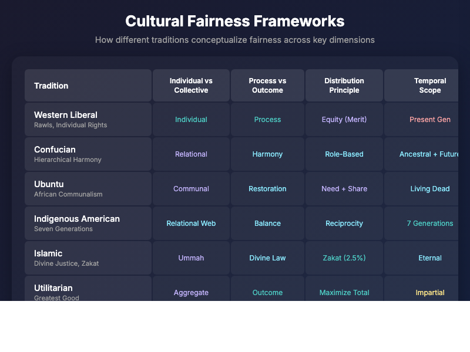

# MicroSimulations

This page provides an overview of all the interactive MicroSimulations available in the Ethics in Modern Society course. Each MicroSim is designed to help students explore ethical concepts through hands-on interaction.

## Fairness Chapter MicroSims

### AI Fairness Trade-offs Explorer

Explore why different algorithmic fairness definitions cannot all be satisfied simultaneously. This simulation demonstrates the impossibility theorem - when base rates differ between groups, satisfying one fairness metric often violates another.

[View AI Fairness Trade-offs MicroSim](./ai-fairness-tradeoffs/index.md){ .md-button }

---

### Cultural Fairness Frameworks

Compare how six major cultural and philosophical traditions conceptualize fairness across five key dimensions. Click any cell to see detailed explanations and examples.

[View Fairness Frameworks MicroSim](./fairness-frameworks/index.md){ .md-button }

---

### Fairness Evolution Timeline

Explore the evolutionary emergence of fairness-related cognitive capacities across species over 300 million years of natural history.

[View Fairness Evolution MicroSim](./fairness-evolution/index.md){ .md-button }

---

### AI Model Consensus: Fairness Venn Diagram

Compare which historical figures four AI models (Claude, ChatGPT, Grok, DeepSeek) identified as champions of fairness or architects of unfairness.

[View Fairness Venn MicroSim](./fairness-venn/index.md){ .md-button }

---

## Other MicroSims

### Bias Classifier Quiz

Test your ability to identify different types of cognitive biases through interactive scenarios.

[View Bias Classifier Quiz](./bias-classifier-quiz/index.md){ .md-button }

---

### Critical Thinking Framework

Explore the components of critical thinking and how they apply to ethical reasoning.

[View Critical Thinking MicroSim](./critical-thinking/index.md){ .md-button }

---

### Ethics Education Timeline

A chronological exploration of the history of ethics education from ancient philosophy to modern approaches.

[View Ethics Education Timeline](./ethics-education-timeline/index.md){ .md-button }

---

### Ethics Process Flow

Visualize the step-by-step process of ethical decision-making using a flowchart approach.

[View Ethics Process Flow](./ethics-process-flow/index.md){ .md-button }

---

### Learning Graph Viewer

Explore the concept dependencies and learning paths in the ethics course curriculum.

[View Graph Viewer](./graph-viewer/index.md){ .md-button }

---

### Harm Bubble Chart

Compare the relative harm of different industries and practices using an interactive bubble chart visualization.

[View Harm Bubble Chart](./harm-bubble-chart/index.md){ .md-button }

---

### Leverage Iceberg

Explore Donella Meadows' leverage points framework using an iceberg model visualization.

[View Leverage Iceberg](./leverage-iceberg/index.md){ .md-button }

---

### Industry Ranking Simulation

Rank different industries by their ethical impact using various criteria.

[View Ranking Simulation](./ranking/index.md){ .md-button }

---

### Technology Adoption Curves

Explore how ethical technologies and practices spread through society over time.

[View Technology Adoption MicroSim](./technology-adoption/index.md){ .md-button }

---

### Tobacco Industry System Dynamics

A systems thinking visualization of the tobacco industry's impact on public health, showing feedback loops and leverage points.

[View Tobacco System MicroSim](./tobacco-system/index.md){ .md-button }

---

## About MicroSims

MicroSimulations are lightweight, interactive educational tools designed for browser-based learning. They feature:

- **Focused scope** - Each addresses one specific learning objective
- **Immediate feedback** - Students see effects of their choices instantly
- **Responsive design** - Works on desktop, tablet, and mobile devices
- **Accessible** - Designed with screen reader support and keyboard navigation

All MicroSims can be embedded in any web page using an iframe and are compatible with learning management systems like Canvas, Blackboard, and Moodle.
