# MicroSimulations

This page provides an overview of all the interactive MicroSimulations available in the Ethics in Modern Society course. Each MicroSim is designed to help students explore ethical concepts through hands-on interaction.

## Fairness Chapter MicroSims

-   **[AI Fairness Trade-offs Explorer](./ai-fairness-tradeoffs/index.md)**

    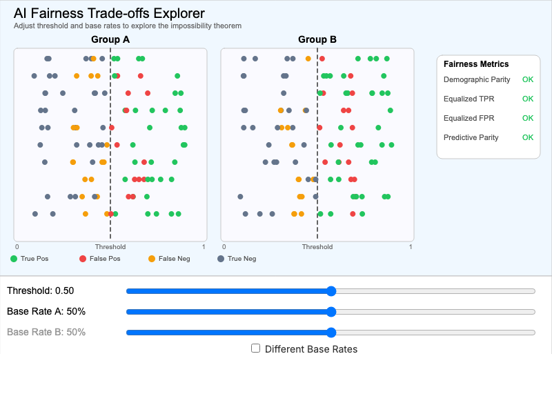

    Explore why different algorithmic fairness definitions cannot all be satisfied simultaneously. Demonstrates the impossibility theorem.

    [:octicons-arrow-right-24: View MicroSim](./ai-fairness-tradeoffs/index.md)

-   **[Cultural Fairness Frameworks](./fairness-frameworks/index.md)**

    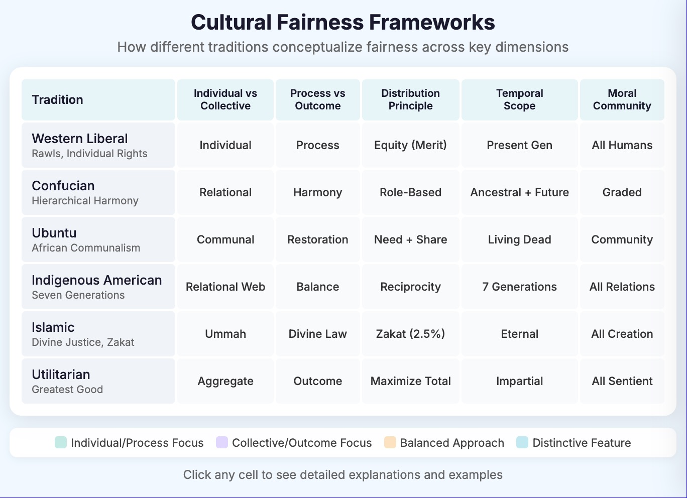

    Compare how six major cultural and philosophical traditions conceptualize fairness across five key dimensions.

    [:octicons-arrow-right-24: View MicroSim](./fairness-frameworks/index.md)

-   **[Fairness Evolution Timeline](./fairness-evolution/index.md)**

    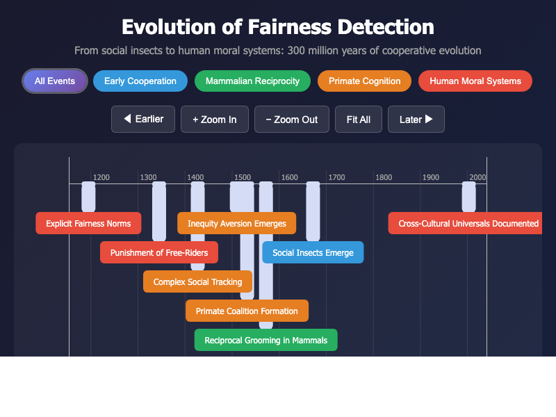

    Explore the evolutionary emergence of fairness-related cognitive capacities across species over 300 million years.

    [:octicons-arrow-right-24: View MicroSim](./fairness-evolution/index.md)

-   **[AI Model Consensus: Fairness Venn](./fairness-venn/index.md)**

    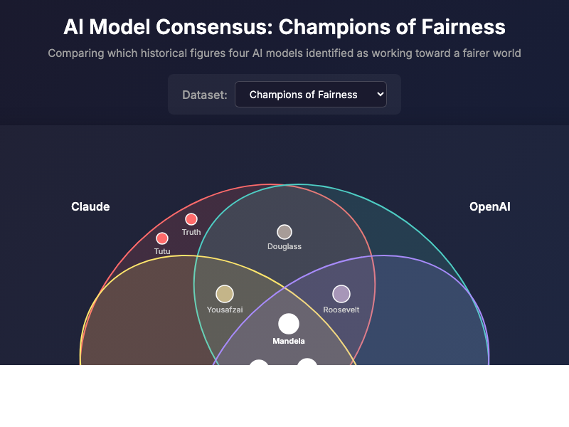

    Compare which historical figures four AI models identified as champions of fairness or architects of unfairness.

    [:octicons-arrow-right-24: View MicroSim](./fairness-venn/index.md)

## Other MicroSims

-   **[Bias Classifier Quiz](./bias-classifier-quiz/index.md)**

    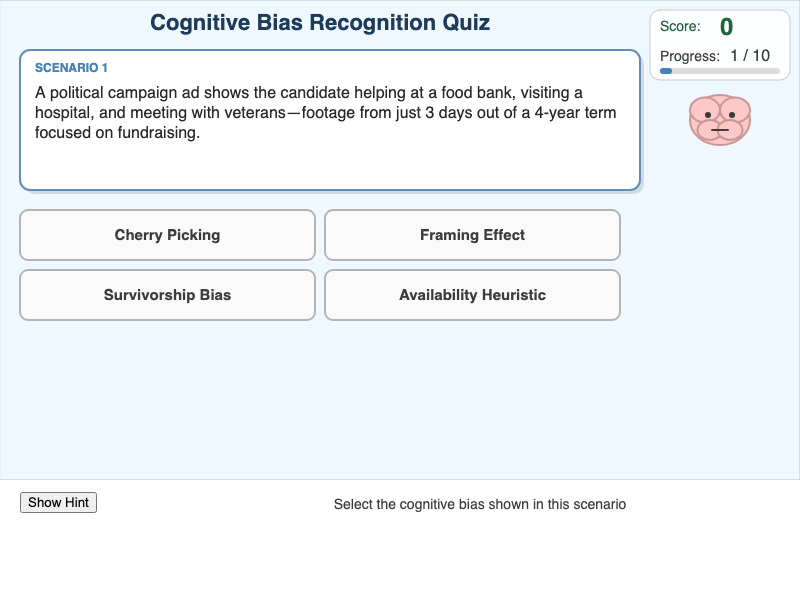

    Test your ability to identify different types of cognitive biases through interactive scenarios.

    [:octicons-arrow-right-24: View MicroSim](./bias-classifier-quiz/index.md)

-   **[Critical Thinking Framework](./critical-thinking/index.md)**

    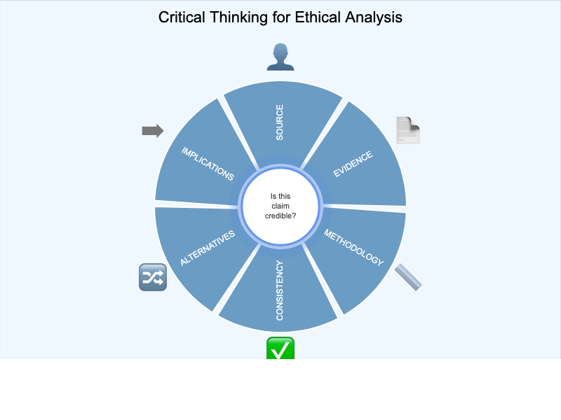

    Explore the components of critical thinking and how they apply to ethical reasoning.

    [:octicons-arrow-right-24: View MicroSim](./critical-thinking/index.md)

-   **[Ethics Education Timeline](./ethics-education-timeline/index.md)**

    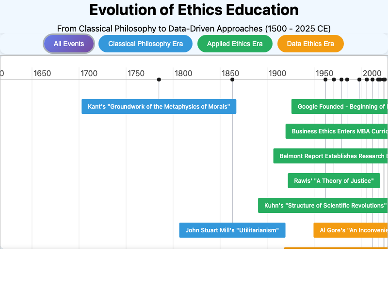

    A chronological exploration of the history of ethics education from ancient philosophy to modern approaches.

    [:octicons-arrow-right-24: View MicroSim](./ethics-education-timeline/index.md)

-   **[Ethics Process Flow](./ethics-process-flow/index.md)**

    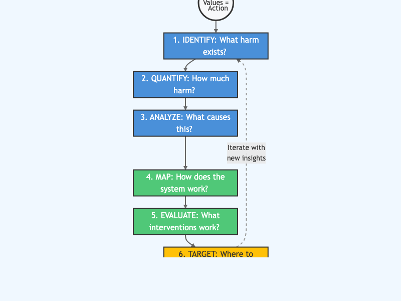

    Visualize the step-by-step process of ethical decision-making using a flowchart approach.

    [:octicons-arrow-right-24: View MicroSim](./ethics-process-flow/index.md)

-   **[Learning Graph Viewer](./graph-viewer/index.md)**

    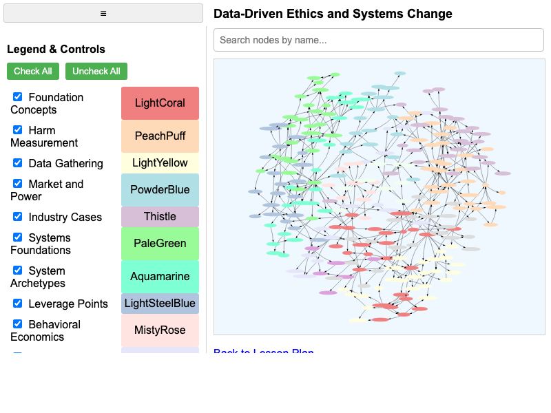

    Explore the concept dependencies and learning paths in the ethics course curriculum.

    [:octicons-arrow-right-24: View MicroSim](./graph-viewer/index.md)

-   **[Harm Bubble Chart](./harm-bubble-chart/index.md)**

    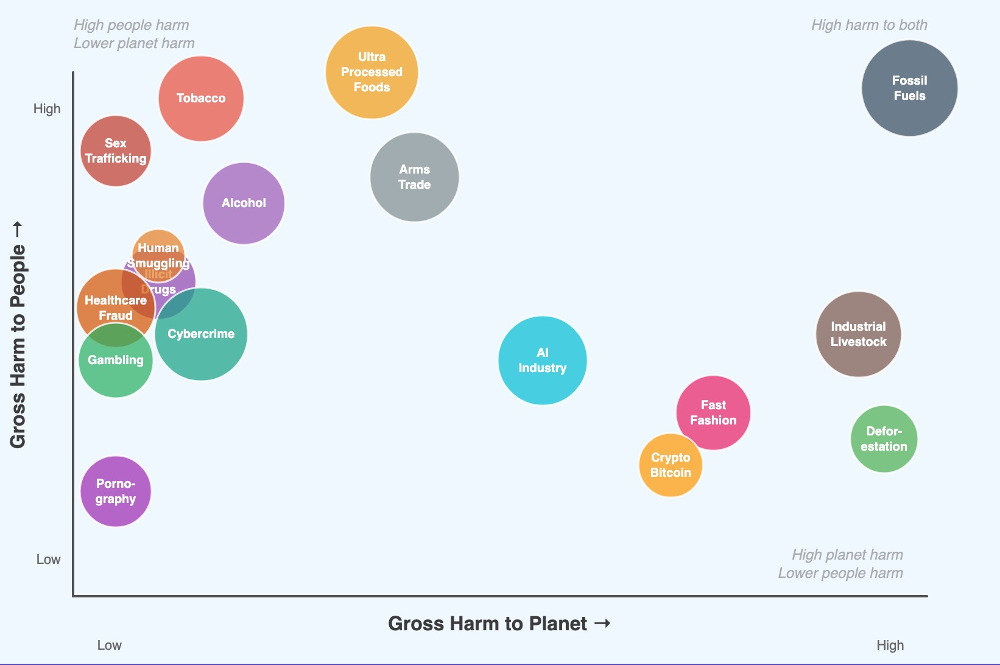

    Compare the relative harm of different industries and practices using an interactive bubble chart.

    [:octicons-arrow-right-24: View MicroSim](./harm-bubble-chart/index.md)

-   **[Leverage Iceberg](./leverage-iceberg/index.md)**

    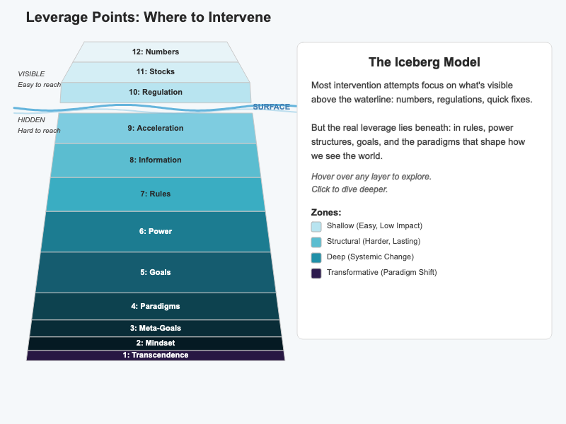

    Explore Donella Meadows' leverage points framework using an iceberg model visualization.

    [:octicons-arrow-right-24: View MicroSim](./leverage-iceberg/index.md)

-   **[Industry Ranking Simulation](./ranking/index.md)**

    :material-sort-numeric-ascending:{ .lg .middle }

    Rank different industries by their ethical impact using various criteria.

    [:octicons-arrow-right-24: View MicroSim](./ranking/index.md)

-   **[Technology Adoption Curves](./technology-adoption/index.md)**

    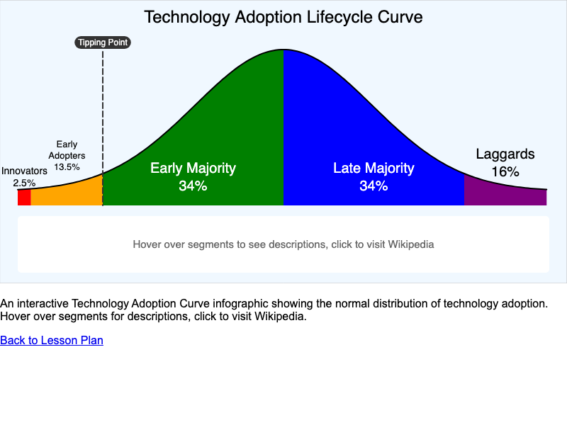

    Explore how ethical technologies and practices spread through society over time.

    [:octicons-arrow-right-24: View MicroSim](./technology-adoption/index.md)

-   **[Tobacco Industry System Dynamics](./tobacco-system/index.md)**

    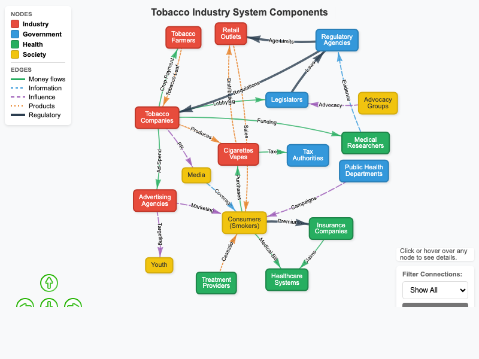

    A systems thinking visualization of the tobacco industry's impact on public health.

    [:octicons-arrow-right-24: View MicroSim](./tobacco-system/index.md)

## About MicroSims

MicroSimulations are lightweight, interactive educational tools designed for browser-based learning. They feature:

:material-target:{ .lg } **Focused scope**
:   Each addresses one specific learning objective

:material-flash:{ .lg } **Immediate feedback**
:   Students see effects of their choices instantly

:material-responsive:{ .lg } **Responsive design**
:   Works on desktop, tablet, and mobile devices

:material-human:{ .lg } **Accessible**
:   Designed with screen reader support and keyboard navigation

All MicroSims can be embedded in any web page using an iframe and are compatible with learning management systems like Canvas, Blackboard, and Moodle.
