# Fairness in Ethics

## Panel 01 – Fairness in the Animal World

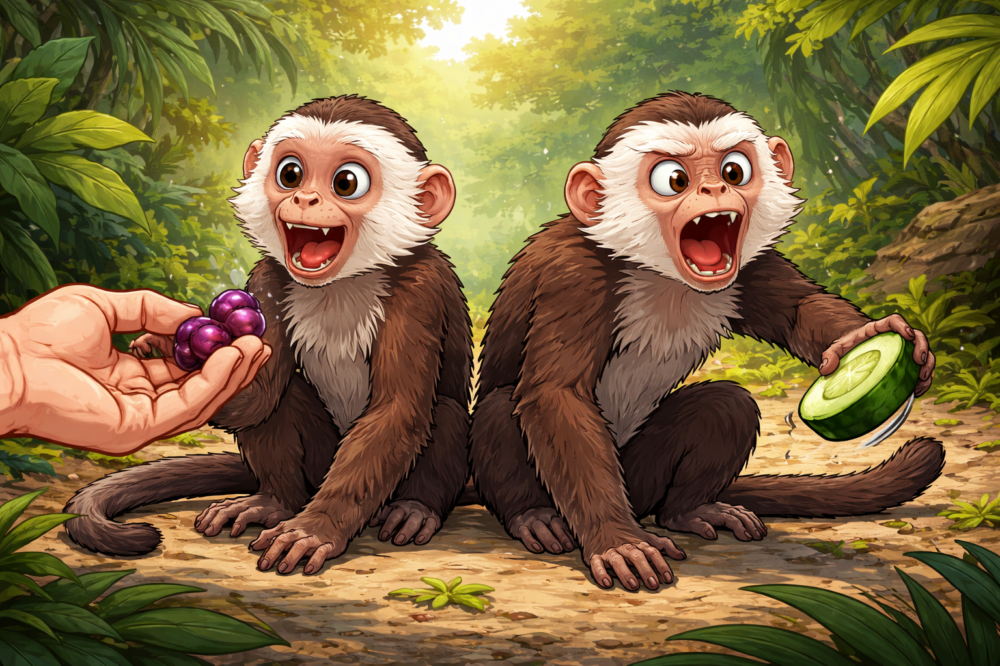

Image 01  
A wide-landscape 16:9 illustration of two capuchin monkeys sitting side by side in a natural jungle environment. One monkey happily receives a grape from a human hand, while the other receives a cucumber slice. The second monkey throws the cucumber away in frustration, eyes wide and body tense. The color palette is lush greens and browns with bright pops of fruit color, emphasizing emotion and contrast.

**Narrative:**
Fairness is not just a human idea. Many animals react strongly when they feel they are treated unfairly.

## Panel 02 – A Sense of Justice

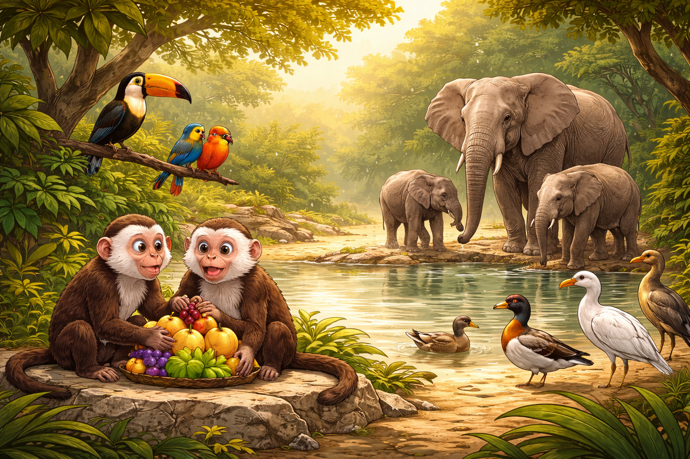

Image 02  
A wide-landscape 16:9 illustration showing multiple animals—monkeys, birds, and elephants—interacting peacefully near a watering hole. Subtle visual cues show equal sharing of food and space. The palette is warm earth tones with soft sunlight, creating a sense of balance and harmony.

**Narrative:**
If fairness appears in other species, what role does it play in human ethics?

## Panel 03 – Fairness Is Not Fixed

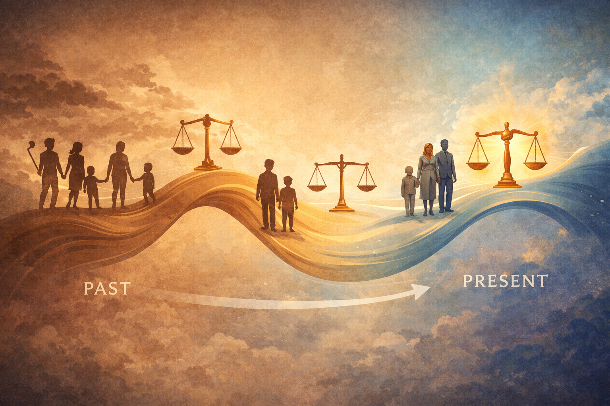

Image 03  
A wide-landscape 16:9 illustration of a flowing timeline stretching from left (past) to right (present). Silhouettes of people and scales of justice shift shape along the timeline. Colors transition from muted sepia tones on the left to brighter blues and golds on the right.

**Narrative:**
What we believe is fair is not permanent. It changes as societies grow, learn, and reflect.

## Panel 04 – Two Children, One Difference

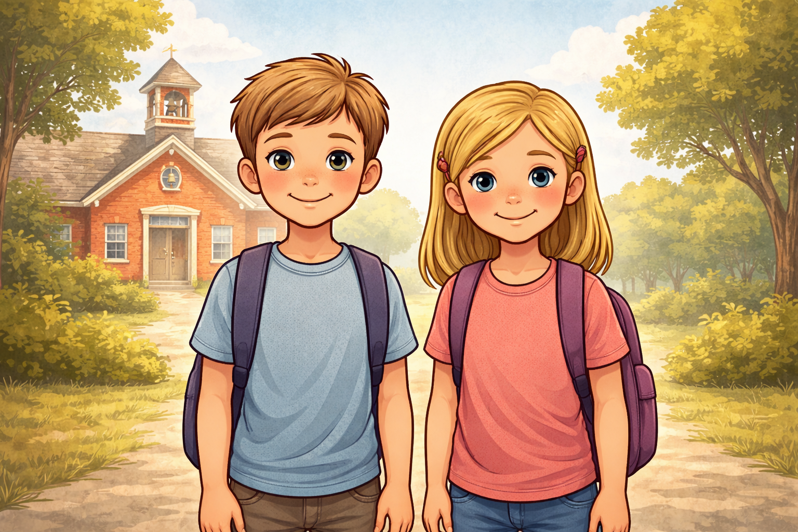

Image 04  
A wide-landscape 16:9 illustration of a young boy and girl standing side by side. They are similar in height, clothing style, hair color, and expression. Behind them is a simple schoolhouse. The color palette is neutral and balanced, emphasizing their similarity.

**Narrative:**
Imagine two children—nearly identical in every visible way.

## Panel 05 – A Closed Door

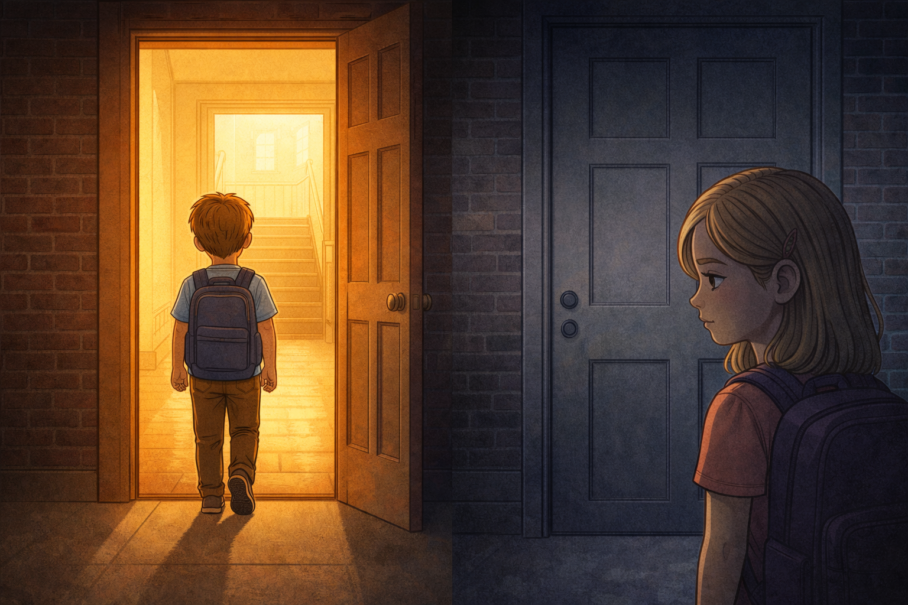

Image 05
Please generate a new image.
A wide-landscape 16:9 illustration showing the boy entering a school door filled with warm light, while the girl stands outside facing a closed door. Shadows fall across her face. The palette contrasts warm golds inside with cool grays and blues outside.

**Narrative:**
For much of history, girls were denied education, property rights, voting, and legal equality.

## Panel 06 – Changing the Rules

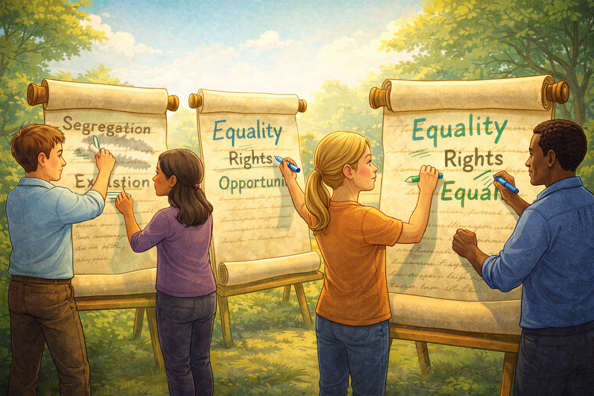

Image 06
Please generate a new image.
A wide-landscape 16:9 illustration of laws being written and rewritten on large scrolls. Men and women stand together, erasing old words and replacing them with new ones. The palette shifts to brighter colors—greens, blues, and hopeful yellows.

**Narrative:**
Over time, societies recognized this imbalance as unfair—and chose to change it.

## Panel 07 – Equal Opportunity

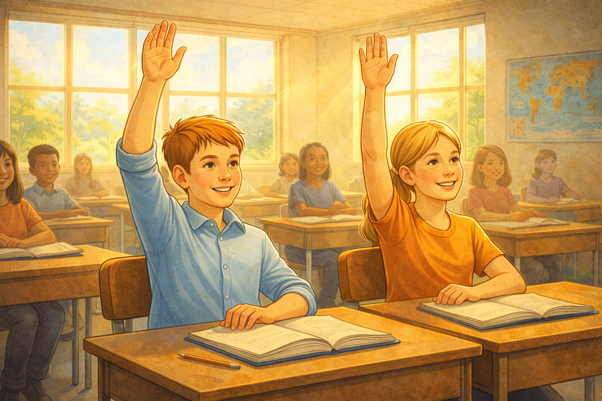

Image 07
Please generate a new image. 
A wide-landscape 16:9 illustration of the same boy and girl now sitting together in a classroom, raising their hands. Light streams through windows. The palette is warm and optimistic, with balanced composition.

**Narrative:**
Fairness grew when equal opportunity became the goal.

## Panel 08 – Another Small Difference

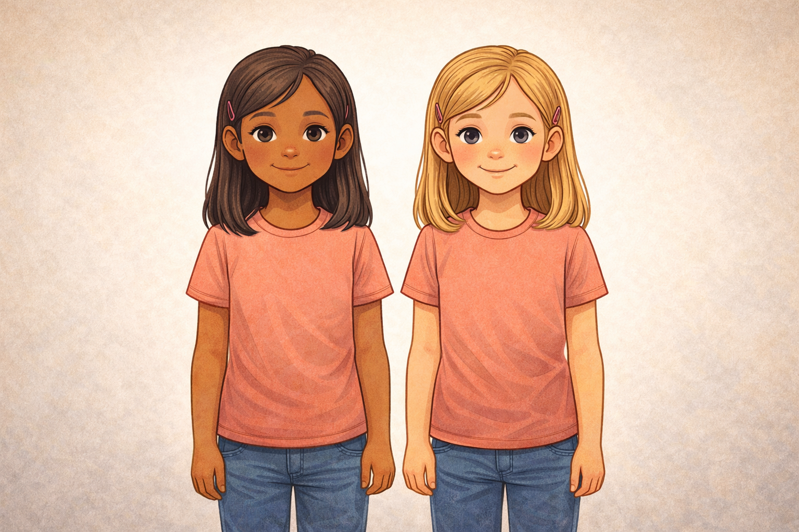

Image 08
Please generate a new image.
A wide-landscape 16:9 illustration of two girls standing together. Their height, clothing, and posture are the same, but one has slightly darker skin. The background is neutral, drawing attention to how small the difference truly is.

**Narrative:**
Now consider another example—skin color, differing only slightly.

## Panel 09 – Unequal Paths

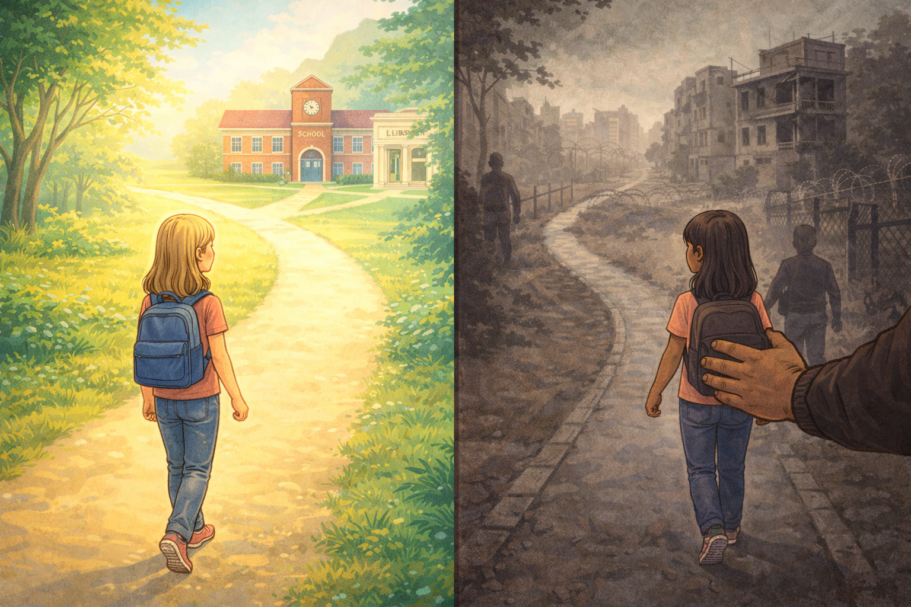

Image 09
Please generate a new image.
A wide-landscape 16:9 illustration where one girl walks along a bright path toward a school and library, while the other is guided down a darker, narrower road. The color palette contrasts bright pastels with desaturated browns and grays.

**Narrative:**
For generations, this small difference determined access to education, safety, and dignity.

## Panel 10 – Recognizing Injustice

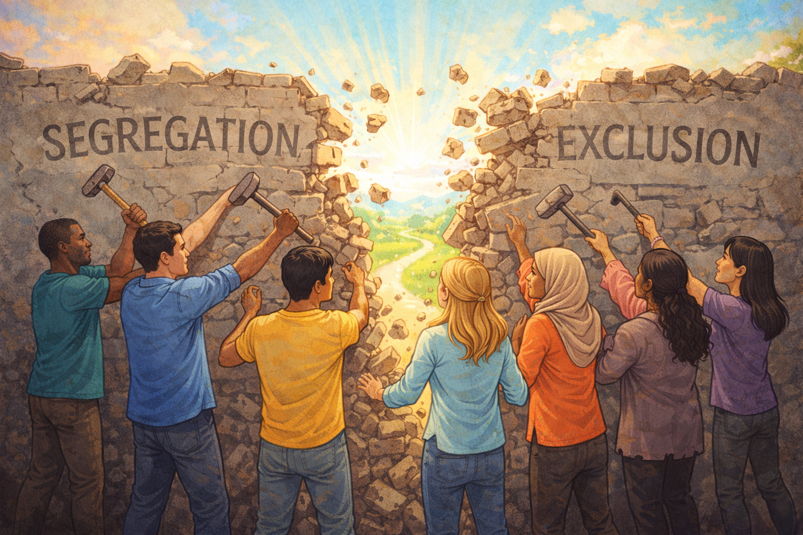

Image 10
Please generate a new image. 
A wide-landscape 16:9 illustration of diverse people standing together, breaking down a wall labeled with faded words like “Segregation” and “Exclusion.” The palette is vibrant, symbolizing unity and progress.

**Narrative:**
Societies learned that judging worth by skin color alone was deeply unfair.

## Panel 11 – Invisible Lines

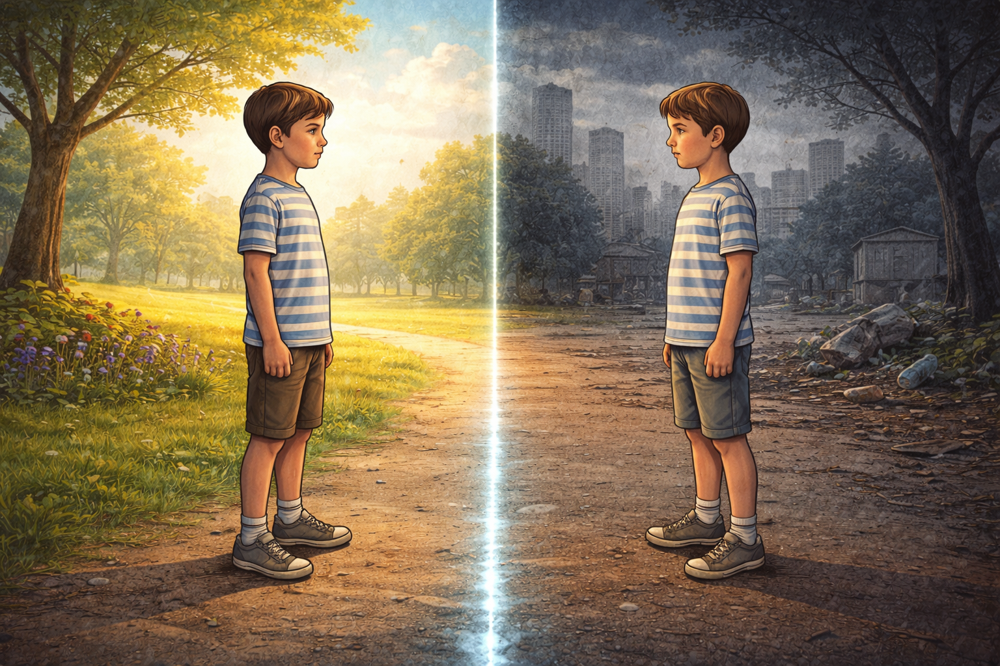

Image 11
Please generate a new image. 
A wide-landscape 16:9 illustration of two boys standing on opposite sides of a faint glowing line on the ground. The line is subtle but powerful. The boys look identical. One side is calm and bright; the other is tense and dark.

**Narrative:**
Today, fairness is often shaped by borders we cannot see.

## Panel 12 – Two Very Different Futures

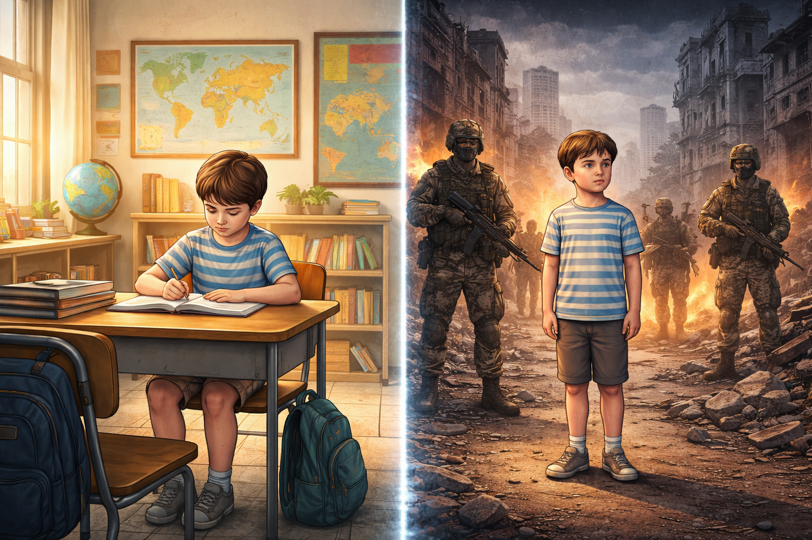

Image 12
Please generate a new image.
A wide-landscape 16:9 split illustration. On the left, one boy studies in a safe classroom with maps and books. On the right, the other boy stands amid armed figures and crumbling buildings. The color palette sharply contrasts safety and chaos.

**Narrative:**
One child gains protection, freedom, and opportunity.
The other faces violence, fear, and forced choices.

## Panel 13 – The Hard Question

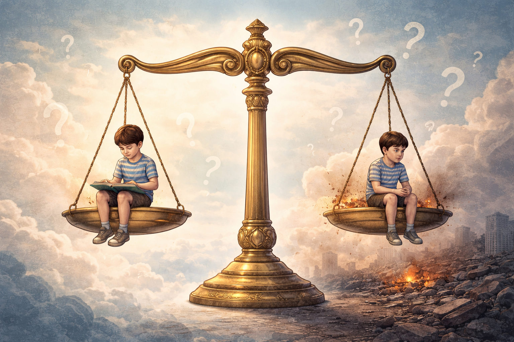

Image 13
Please generate a new image.
A wide-landscape 16:9 illustration of a large scale of justice floating in the sky, holding the two boys on opposite sides. The scale is unbalanced, and the background fades into questioning symbols and soft clouds.

**Narrative:**
Are these boys being treated fairly?
And what is our responsibility to them?

## Panel 14 – Fairness as a Choice

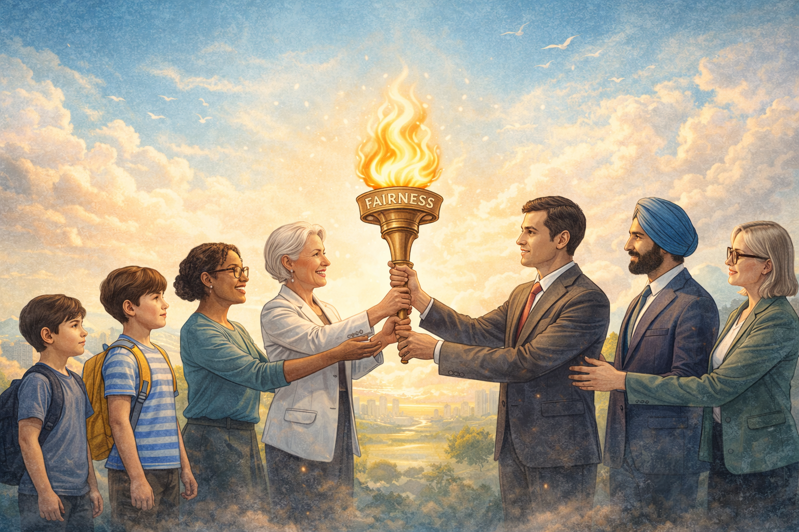

Image 14  
Please generate a new image.
A wide-landscape 16:9 illustration of people across generations—students, teachers, and leaders—passing a glowing torch labeled “Fairness.” The world behind them grows brighter. The palette is hopeful blues, greens, and golds.

**Narrative:**
Fairness is not guaranteed.
It grows through education, ethical leadership, and the courage to care beyond ourselves.

### Closing Reflection

Ethics is situational, shaped by time and circumstance.
History shows us that fairness expands when people choose understanding over fear—and contracts when they do not.
The future of fairness is still being written.
